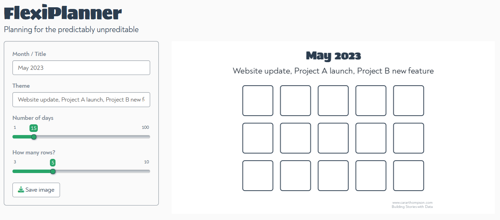
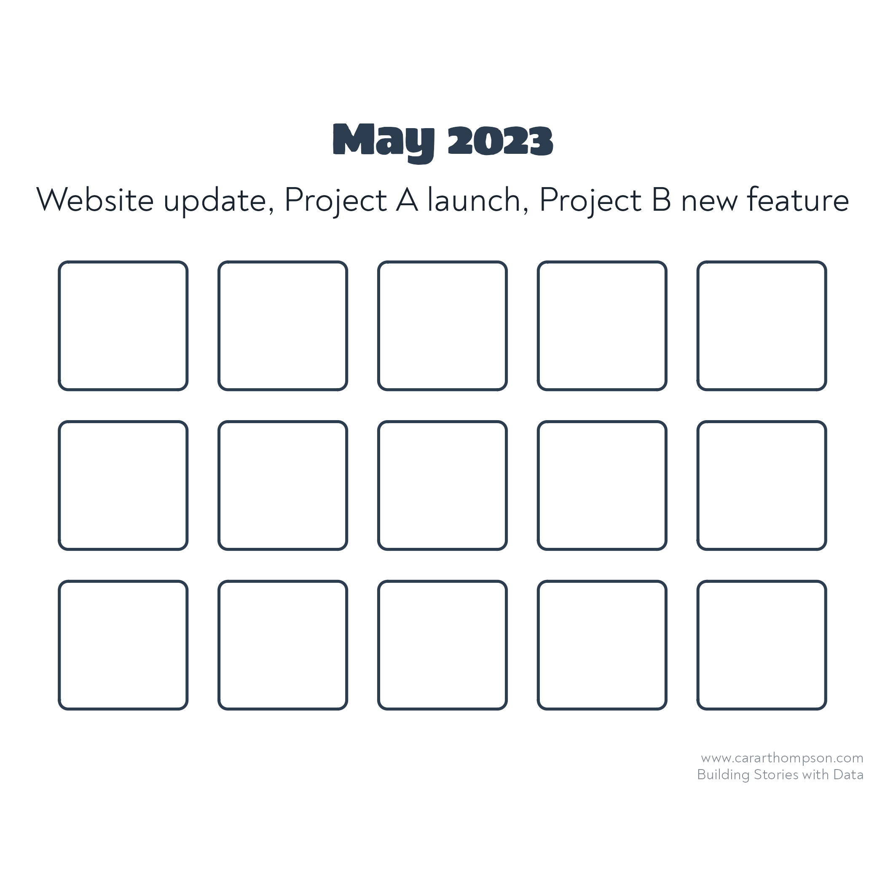

```{r setup, include=FALSE}
knitr::opts_chunk$set(echo = TRUE)
```

## Planning for the predictably unpredictable

This repo contains the code for the [FlexiPlanner Shiny App](https://cararthompson.shinyapps.io/flexiplanner/) I built to help me plan my workload, and set goals. The app creates images which can be downloaded and printed out, with the aim of helping users visualise how much project time they have left within a given time period, or visualise their progress towards a goal. 



### Work plan example

Figure out how many chunks of time (days / half days) you have in a month, set yourself a theme, print it out, and grey out the boxes that are already allocated. When considering a new project, see how many boxes you have left! 

<center>
{width=50%}
</center>


### Goal setting example

Print out and tick the boxes once the goal is reached. 

<center>
{width=50%}
</center>
